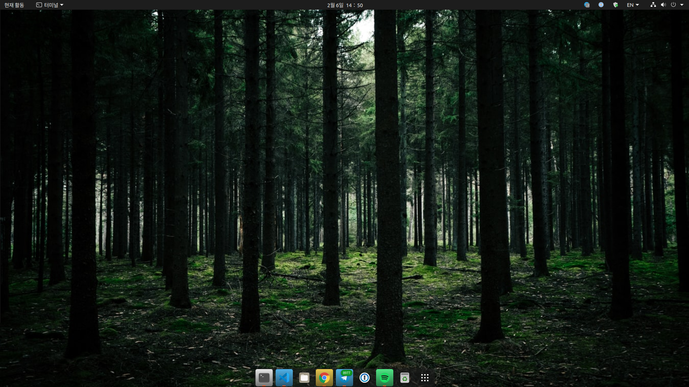

# 나만의 우분투 데스크탑 설정

1. Background

- https://unsplash.com/photos/k5Vj3gx4vHE

2. terminal 투명도 설정


3. VS Code 설치

> https://gist.github.com/philoskim/a79440bd51ae40f04a4d7cafa472caf1

snap으로 설치할 경우 한글이 입력되지 않는다.
Slack 등 다른 애플리케이션도 snap으로 설치하면 마찬가지로 한영 전환(`Shift`+`Space`)이 안 된다.
(저는 Slack을 우분투 소프트웨어 센터에서 설치했는데 snap을 통해 설치되나 보네요)


- Slack도 [홈페이지에서 직접 다운로드](https://slack.com/intl/en-kr/downloads/linux)하시면 됩니다.

```bash
# 기존에 snap으로 설치했다면 삭제
sudo snap remove code

cd /tmp
# https://code.visualstudio.com/download `.deb` 파일 다운로드
wget https://az764295.vo.msecnd.net/stable/ea3859d4ba2f3e577a159bc91e3074c5d85c0523/code_1.52.1-1608136922_amd64.deb

# 설치
sudo dpkg -i code_1.52.1-1608136922_amd64.deb

# 지울 때는
# sudo dpkg -r code
```

4. command auto suggestion (not fuzzy suggestion)

- fish: 자체 제공

```bash
sudo apt install -y fish
which fish
# /usr/bin/fish
```

```bash
cat /etc/shells
# /bin/sh
# /bin/bash
# /usr/bin/bash
# /bin/rbash
# /usr/bin/rbash
# /bin/dash
# /usr/bin/dash
# /usr/bin/tmux
# /usr/bin/fish
```

```bash
echo $SHELL
# /bin/bash
chsh --shell /usr/bin/fish
cat /etc/passwd | grep `cd; pwd`
# changsu:x:1000:1000:changsu,,,:/home/changsu:/usr/bin/fish
# >>> 리부트!
```

- zsh: 플러그인 설치(https://github.com/zsh-users/zsh-autosuggestions)

```bash
sudo apt-get install zsh
```

5. vim

```bash
sudo apt-get install vim
```

- [$HOME/.vimrc](./.vimrc)

6. tmux

```bash
sudo apt-get install tmux
```

- [$HOME/.tmux.conf](./.tmux.conf)

7. dock

```bash
gsettings set org.gnome.shell.extensions.dash-to-dock extend-height false
gsettings set org.gnome.shell.extensions.dash-to-dock dock-position BOTTOM
gsettings set org.gnome.shell.extensions.dash-to-dock transparency-mode FIXED
gsettings set org.gnome.shell.extensions.dash-to-dock dash-max-icon-size 32
gsettings set org.gnome.shell.extensions.dash-to-dock unity-backlit-items true
```



- dock에 있는 앱들을 `Super`+`숫자` 조합으로 선택할 수 있다.

8. GNOME Shell Extensions

- 도움되는 확장 기능

0. 블로깅을 위한 hugo 다운로드

```bash
sudo apt-get install hugo
```
