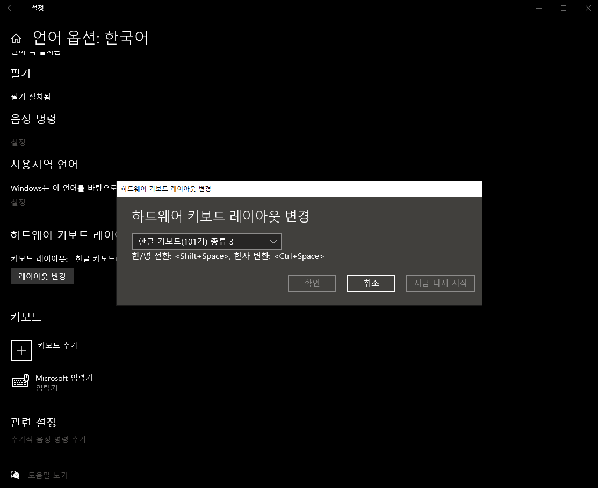
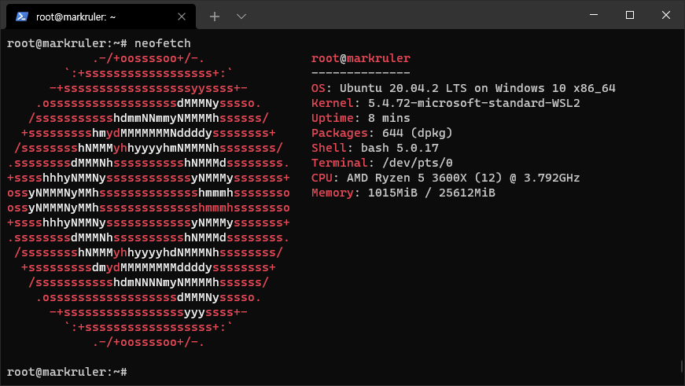
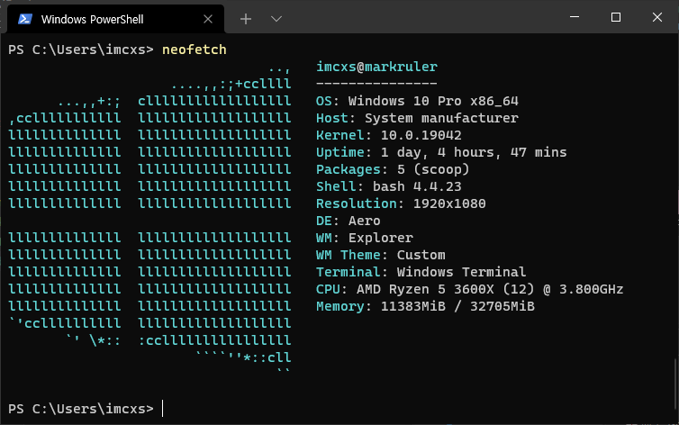

# 윈도우 데스크탑 세팅

## 한영전환키 변경

`언어 설정` - `기본 설정 언어` - `한국어` - `옵션` - `하드웨어 키보드 레이아웃` - `한글 키보드(101키) 종류3`

> - 한영전환키: `shift` + `space`
> - 한자전환키: `ctrl` + `space`



## Hyper-V 활성화

```powershell
Enable-WindowsOptionalFeature -Online -FeatureName Microsoft-Hyper-V -All
# reboot
```

## WSL2 (Windows Subsystem for Linux 2) 활성화

- [Microsoft manual](https://docs.microsoft.com/en-us/windows/wsl/install-win10)
- [44bits 참고](https://www.44bits.io/ko/post/wsl2-install-and-basic-usage)

Windows PowerShell을 관리자 권한으로 열어서 (`shift` + `ctrl` + `mouse left`) 아래 명령어를 차례대로 실행시킵니다.

```powershell
dism.exe /online /enable-feature /featurename:Microsoft-Windows-Subsystem-Linux /all /norestart
dism.exe /online /enable-feature /featurename:VirtualMachinePlatform /all /norestart
```

```powershell
Restart-Computer
```

- [wsl](https://aka.ms/wslstore)

```powershell
# wsl --list --verbose
wsl -l -v
#   NAME      STATE           VERSION
# * Ubuntu    Running         1
```

- [wsl2](https://docs.microsoft.com/ko-kr/windows/wsl/install-win10#step-4---download-the-linux-kernel-update-package)
  - `x64 머신용 최신 WSL2 Linux 커널 업데이트 패키지` 설치

```powershell
# 두 버전의 WSL에 의해 지원되도록 배포를 설정하려면 다음을 실행합니다.
# wsl --set-version <distribution name> <versionNumber>
wsl --set-version Ubuntu 2

# WSL 2를 기본 아키텍처로 설정하려는 경우 이 명령을 사용하여 수행할 수 있습니다.
wsl --set-default-version 2
```

WSL을 사용하고 싶다면 원하는 위치에서 `wsl` 명령어를 실행시킵니다.

```powershell
wsl
```

WSL2의 네트워크는 Hyper-V 가상화 기반으로 동작하고 있어서 부득이하게 이 IP는 재부팅 시 변경되어 버리니 주의가 필요합니다.

```bash
ip -br -c -4 a show eth0
# eth0             UP             172.25.17.72/20
```

```bash
sudo -i
apt-get update
apt-get install -y neofetch
```



## [scoop](https://github.com/lukesampson/scoop)

Windows 환경의 패키지 매니저

```powershell
# Set-ExecutionPolicy -ExecutionPolicy RemoteSigned -Scope CurrentUser
Invoke-Expression (New-Object System.Net.WebClient).DownloadString('https://get.scoop.sh')
```

## [neofetch](https://github.com/dylanaraps/neofetch)

```powershell
scoop install neofetch
scoop install git
neofetch
```



## [sdkman](https://sdkman.io/)

```bash
# sdkman이 의존하는 zip 설치
scoop search zip
scoop install zip

# sdkman 설치
curl -s "https://get.sdkman.io" | bash
source "/c/Users/imcxs/.sdkman/bin/sdkman-init.sh"
```

```bash
sdk version
> SDKMAN 5.11.2+698
```

```bash
sdk list
# [gradle, maven, java, ...]

# sdk list [package]
sdk install maven 3.6.3
sdk install gradle 6.8.3
sdk install java 11.0.11.hs-adpt
```
